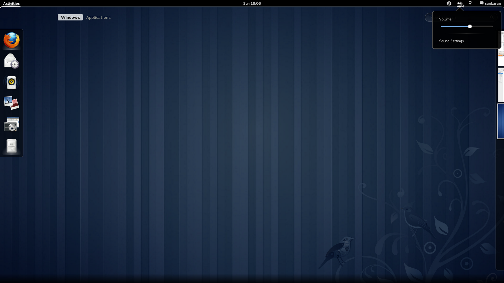
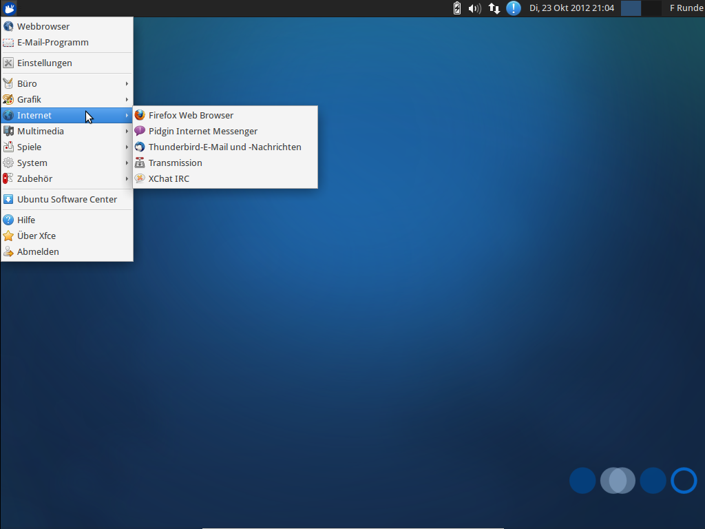
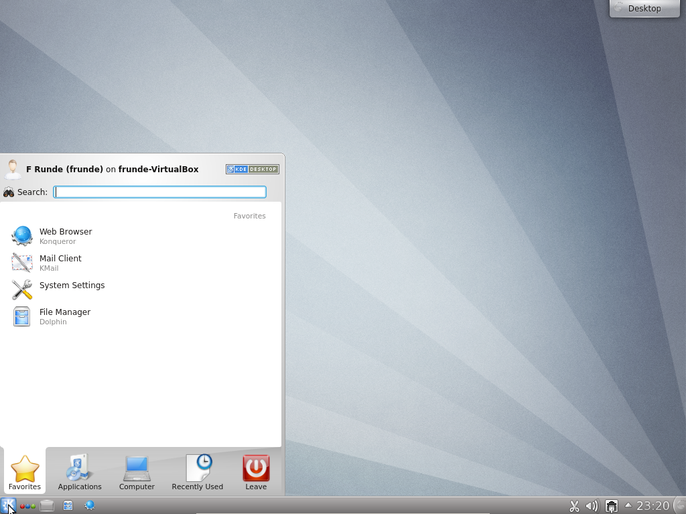

:title: Linux Install Party 2014
:author: Andreas Hechenberger
:description: Linux installation event at the TU Berlin
:keywords: linux, freitagsrunde, presentation, restructuredtext, impress.js
:css: lip2014.css

----

Linux Install Party 2014
========================

Warum wollen wir Linux?
-----------------------

----

Whoami?
=======

Andreas Hechenberger

    **Andy[AT]**

Informatikstudent

Freitagsrunde seit *2008*

EMail: *andy@fraitagsrunde.org*

.. image:: images/by-sa.png
    :height: 50px

----

Warum Linux?
============

    * **Freies** Betriebssystem
    * **Freie** Software
    * lebt duch die community
    * Linux ist großartig und so auch die Auswahl

----

:data-y: r0
:data-scale: 0.5
:data-rotate-x: -90

.. image:: images/tux00.png
    :height: 500px

----

:data-x: r1200
:data-scale: 0.5

----

:data-x: r1200
:data-z: 400
:data-rotate-x: 0
:data-rotate-y: -90
:data-scale: 0.5

----

:data-x: r0
:data-y: r1200
:data-scale: 1

Linux Distributionen
====================

----

:data-rotate-x: 0

Empfehlung
==========

* Für Neueinsteiger empfehlen wir ein Ubuntu oder ein anderes **Debian-Derivat**

* Dabei kann noch zwischen **Desktoptypen** entschieden werden

    * Gnome
    * Xfce
    * KDE
    * ...

----

GNOME
=====

----

XFCE
====

----

KDE
=====

----

:data-x: r1500
:data-rotate-y: 0

Und dann
========

* ... **lernt** euer neues Betriebssystem **kennen** und lieben.

    * findet euch zurecht
    * richtet euer System nach euren wünschen ein
    * installiert coole Software

* Mehr dazu später...

----

:id: help
:data-x: r2500

.. image:: images/filled-logo_trans.png
    :height: 700px
    :align: left

----

:id: helpContent
:data-x: r0

Hilfe
=====

* **BeLUG - Berliner Linux User Group**
    jeden Mittwoch 18-22Uhr

    Lehrter Straße 53, Berlin 

    http://www.belug.org

* Internet
    * Nach Ubuntu Quantal + Problem suchen
    * http://www.ubuntuusers.de (Sehr gutes Wiki!)
    * http://www.linuxquestions.org
    * http://www.startpage.com
    * http://www.youtube.com

----

:data-x: r2000

Blogs
=====

zum stöbern...

* http://www.thegeekstuff.com
* http://www.commandlinefu.com
* http://www.linuxjournal.com
* http://www.cyberciti.biz
* http://linuxundich.de
* http://www.freiesmagazin

----

:id: thx
:data-x: r4000
:data-z: 30000
:data-scale: 400

DANKE
=====

und viel Spaß
-------------

----

:id: src
:data-x: r0
:data-rotate-x: -90

Source
======

Tux: http://tuxgallery.weebly.com

Theme inspired by https://github.com/sixfeetup/sixfeetup_hovercraft